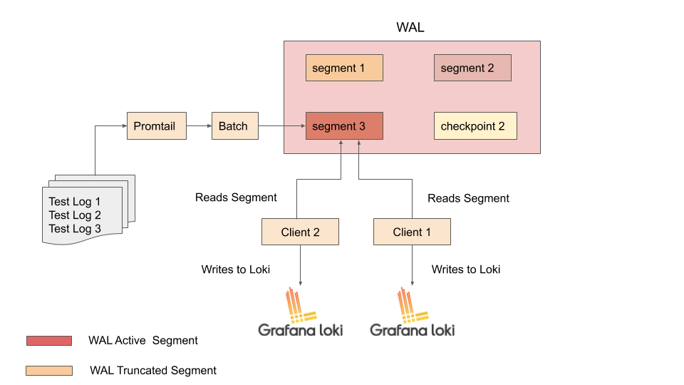

# Promtail-WAL(Write Ahead Log)

## Problem Statement

Promtail should be crash resilient and should allow multiple clients to write to different Loki instances without any client blocking other.


## Use cases

The following use cases should be addressed.

### Logs should not be lost 

With the current version of Promtail, each log line tailed from a file will be added to batch and depending on the configuration of `batch_size` and `batch_wait` it is frequently flushed to destination Loki instance. Also, we retry to send the batch if the `destination is not reachable` or we receive `429/500s` errors. Once, the maximum retries is reached, logs within a `batch` will be permanently lost. So, we will be losing all the logs till the destination Loki intance becomes available. 

The same argument holds when reading non file based inputs like Syslog. We continue iterating the next logs even when `batch` send fails. So, once the Syslog rotation happens there is no easy way to get back these logs. 

Also, when using loki docker-driver, if `batch` was not sent, we lose the logs and for any reason if the container is crashed or removed we can't get back those logs written by a specific container. 


### Should be able to write to multiple Loki instances without any client blocking other

Promtail can write to multiple Loki instances. However, with the current design of Promtail new entries can be added to batch only if the `batch` is completed(sucessful or dropped). If there is an ongoing send from any of the client, other clients won't be able to add new entries to the batch since we use a `entry` channel which is unbuffered and blocks any write until the reciever reads already existing entry. So, in situations where, if one of the client is not able to write to destination Loki instance becasue of unavailablilty, it will keep retrying till the maximum retries is reached and this will block other clients to write new entries and send to it's corresponding Loki instance

## Considered Alternatives

There are couple of ways we can solve the above described issues. However, each solution has it's pros and cons

### Use buffered channel instead of an unbuffered channel

We can create a buffered channel instead of an unbuffered channel. We can initialize a channel with some higher number say for example 1000 so we will be able to receive 1000 additional log lines if the channel is blocked. However, disadvantage of this approach is that it would be difficult for the user to pick a correct number and to be able to save more logs user can define some very high number and it might crash his Promtail instance due to OOM. 

## Use simple mechanisms such as [dqueue](https://github.com/joncrlsn/dque)

This is quite similar to WAL and is resilient to crash. One of our users implemented this for `fluent-bit` client, [#2142](https://github.com/grafana/loki/pull/2142). This would be very good fit for simple, single client use case. However, this library doesn't support two clients pointing to the same segment. Since, we want to support multiple clients it would not be desirable for us to use this library. Also, this library doesn't support compression. Without compression, we might eat up the disk space when huge number of log lines are being ingested. Also, checkpointing is not supported. Of course we can always contribute to this library and do some improvements and later adopt it.  


## Recomended Solution

With weighing all the above points we recomend to implement WAL in Promtail. Following are the items which we should focus while implementing WAL.

1. Support multiple clients to read the same WAL segment.
2. Compress the data which will be stored in WAL. This allows us to have efficient utilization of disk space.
3. Checkpointing, this allows to take frequent snapshots of the pending entries and recover from crash.


### Implementation details, brief overview

This idea is largely taken from Prometheus `remote_write`. 

1. Promtail tails the logs from the files/Sylog and writes to `entry` channel.
2. Create the `batch` based on `batch_size` and write the compressed `batch` to WAL.
3. There would be a `Queue Manager` which manages the queue for each client, which will watch and read the WAL segments.
4. Each queue will read from the WAL segments and send the batch to destination Loki instance. 
5. Create checkpoints by taking frequent snapshot of the pending batches to be sent.
6. Truncate a WAL segment only if there is no read pointer from any of the queue or if the maximum retention of WAL segment is reached.





### Example config in Promtail for WAL

```yaml
clients:
  - url: http://localhost:3100/loki/api/v1/push

wal_config:
  ## path to wal directory
  dir: 

  ## Maximum time to retain a segment before truncating it.
  max_retention:
  ```
